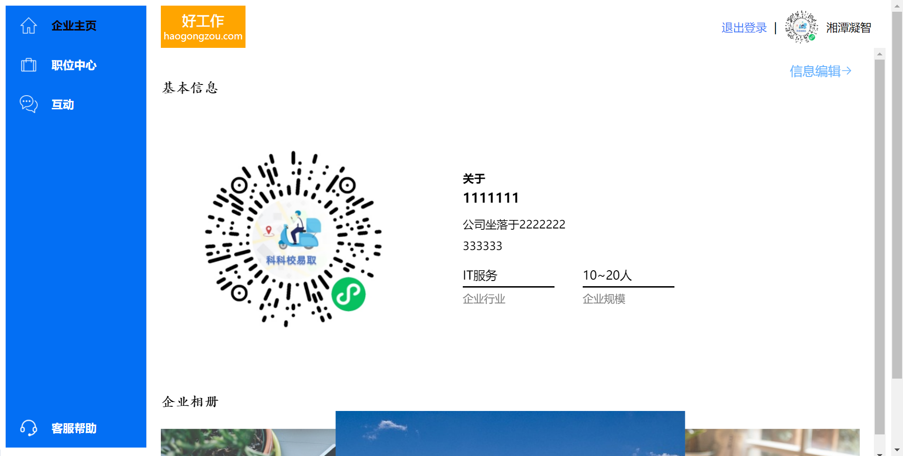
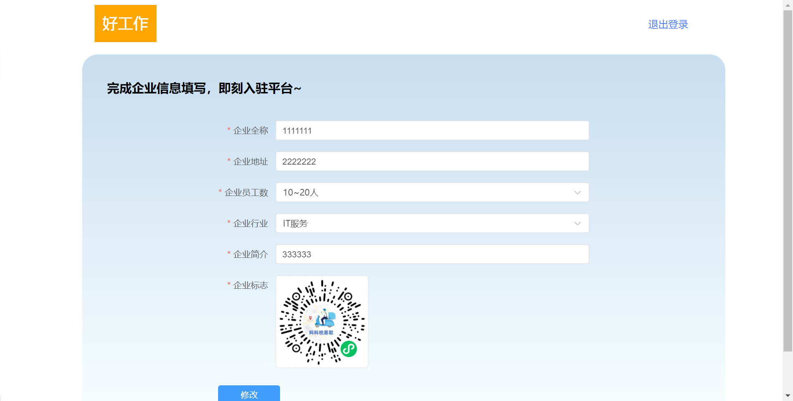
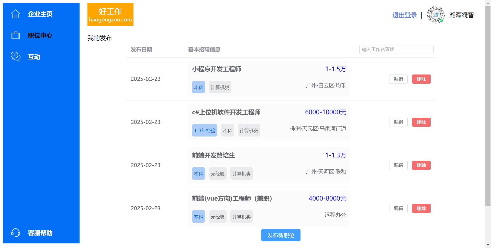
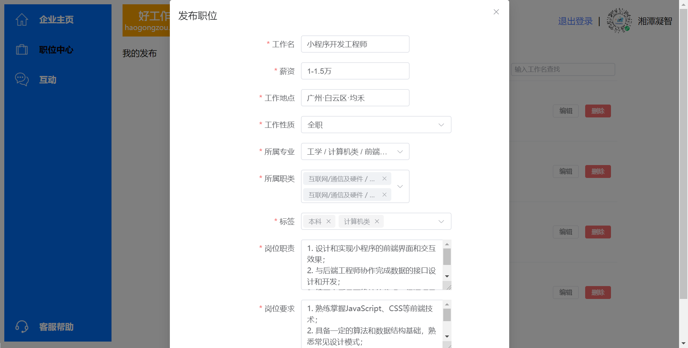
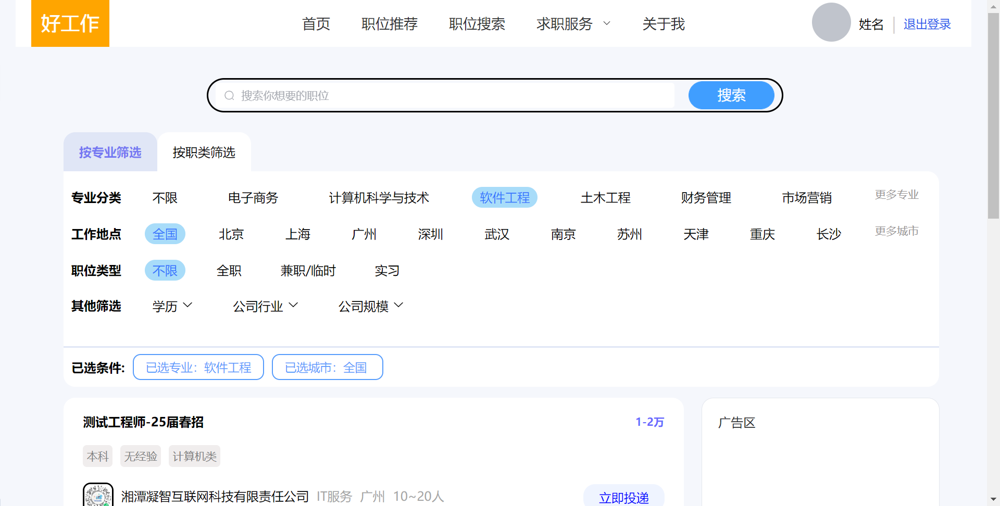
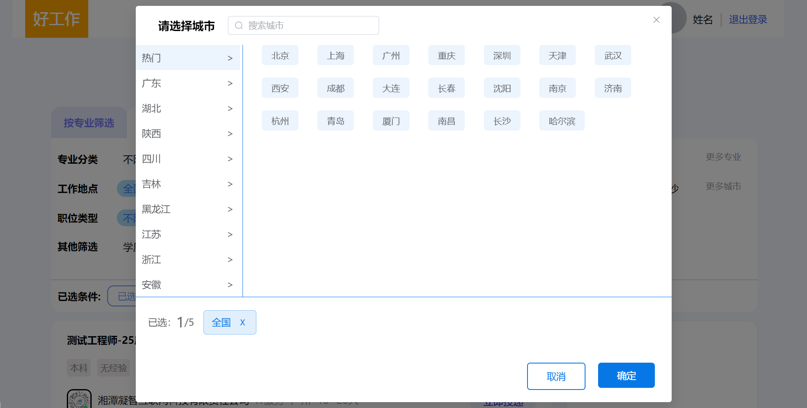
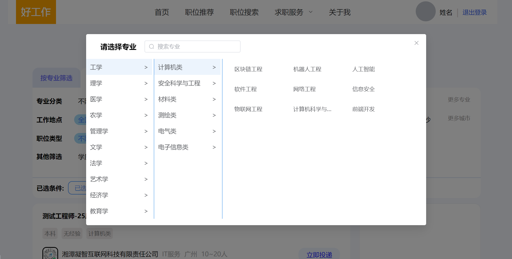
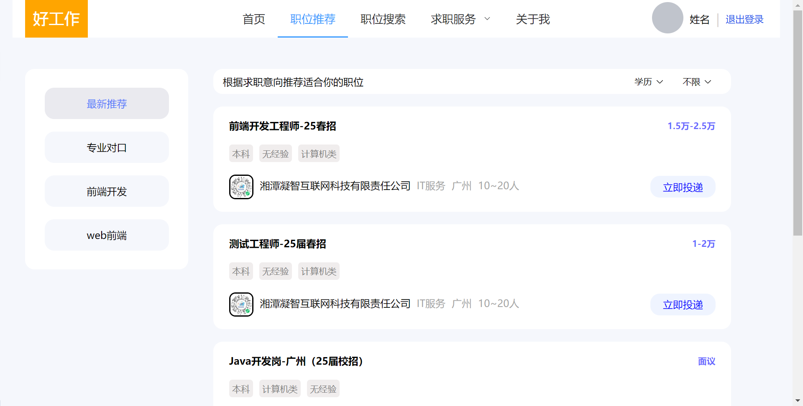

<h2>:rocket:仿智联招聘网站全栈项目:airplane:</h2>
<h3>:computer:技术栈：Vue3、mongodb、Element Plus、node.js</h3>
<h3>已实现功能：</h3>
<h4>企业端：</h4>
<ul>
  <li>1、企业端注册登录、企业基本信息的填写、编辑；</li>
  <li>2、企业端发布职位功能、对已发布的职位进行查找、编辑、删除下架功能</li>
</ul>
<h4>求职者客户端：</h4>
<ul>
  <li>1、用户的注册登录；</li>
  <li>2、首页获取最新职位推荐；</li>
  <li>3、职位推荐界面实现基础部分的功能-获取少量分类标签职位；</li>
  <li>4、职位搜索界面实现了多维度的分类查找职位功能、可按专业分类、职类分类、工作地点（可多选）、职位类型、学历要求、公司行业、公司规模进行数据筛选获取展示；</li>
  <li>5、关于我界面目前暂时实现一个静态的界面布局，后期将完善数据的交互和动态展示</li>
</ul>

<h2>:tv:项目界面展示</h2>

<h3>企业端界面展示：</h3>

<h3>用户端界面展示：</h3>

<h2>:alarm_clock:将持续更新的部分：</h2>
<ul>
  <li>1、用户端的个人信息与简历的功能实现</li>
  <li>2、职位搜索功能的实现</li>
  <li>3、Ai求助功能的上线</li>
  <li>4、简历模版篇的实现</li>
  <li>5、力争实现企业端hr与客户端求职者的实时通讯功能</li>
</ul>
<h3>:exclamation:温馨提示：本项目的所有内容均是虚构，项目仅供学习使用，如有疑问请联系3187538117@qq.com</h3>
<h4>:heart_eyes:创作不易，拒绝白嫖，留下你的Star再走哦~</h4>
