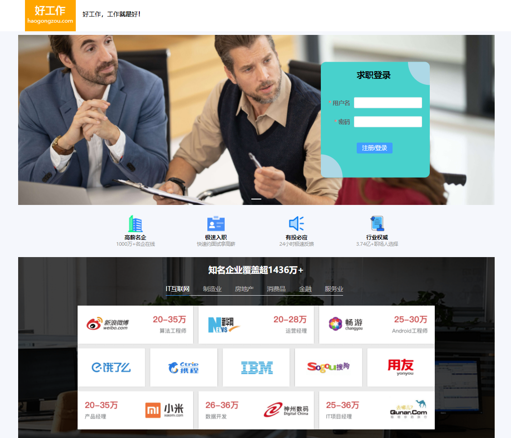
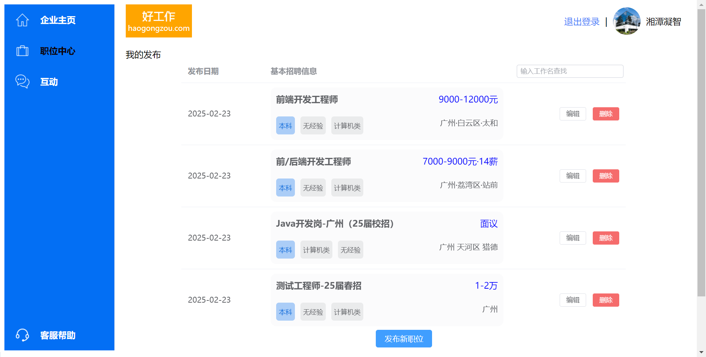
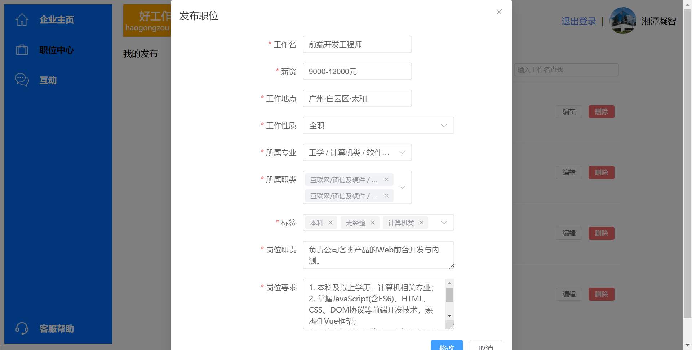
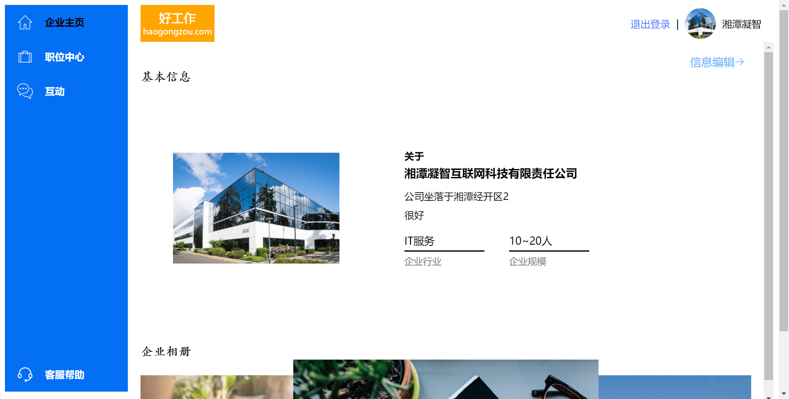
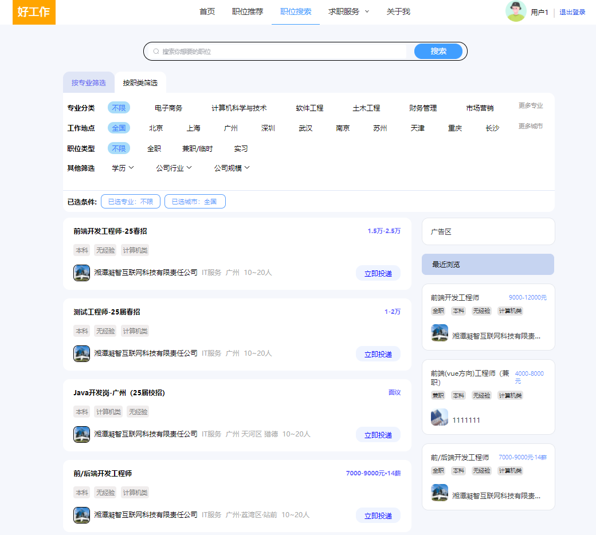
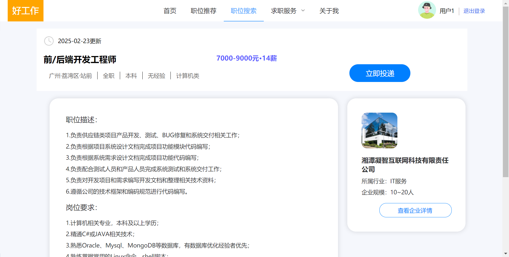
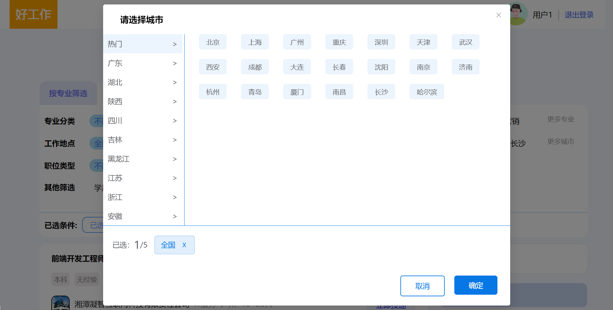
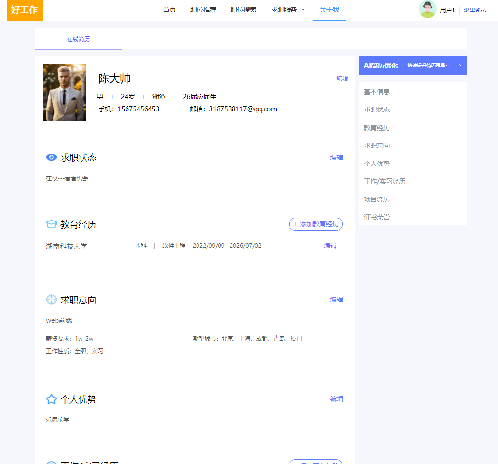
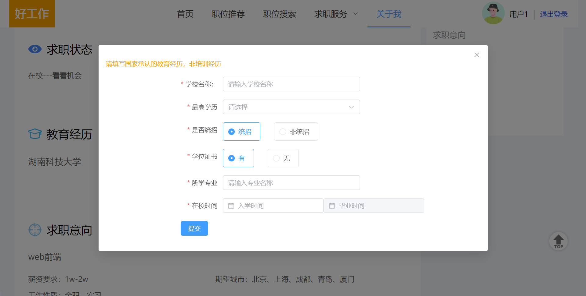

<h2>:rocket:仿智联招聘网站全栈项目:airplane:</h2>
<h3>:computer:技术栈：Vue3、mongodb、Element Plus、node.js、Pinia</h3>
<h3>已实现功能：</h3>
<h4>企业端：</h4>
<ul>
  <li>1、企业端注册登录、企业基本信息的填写、编辑；</li>
  <li>2、企业端发布职位功能、对已发布的职位进行查找、编辑、删除下架功能</li>
</ul>
<h4>求职者客户端：</h4>
<ul>
  <li>1、用户的注册登录；</li>
  <li>2、首页获取最新职位推荐；</li>
  <li>3、职位推荐界面实现基础部分的功能-获取少量分类标签职位；</li>
  <li>4、职位搜索界面实现了多维度的分类查找职位功能、可按专业分类、职类分类、工作地点（可多选）、职位类型、学历要求、公司行业、公司规模进行数据筛选获取展示；</li>
  <li>5、关于我界面实现了用户简历的在线编辑功能，可编辑证件照、项目经历、求职意向等多栏信息</li>
  <li>6、利用Pinia和Vuex持久化操作优化项目，减少不必要的网络重复请求，保留用户浏览的职位界面状态与位置</li>
</ul>
<h4>鉴于数据库数据有限，给予项目运行获取数据指南以获取更好的项目体验：</h4>
<ul>
  <li>企业端账号：用户名：哈哈；密码：123456</li>
  <li>用户端账号：用户名：用户1,；密码：123456</li>
  <li>职位推荐界面获取数据：左侧可选：（前端开发）（web前端）；学历可选部分：本科；工作性质都可选</li>
  <li>职位搜索界面获取数据：专业分类可选：软件工程，前端开发；工作地点可选：广州、全国、株洲；职位类型均可；职类分类可选：（web前端）（c/c++）（C#）（java）；公司规模可选：10-20人</li>
  <li>更多内容可以通过直接查看数据库内容推荐下载MongoDB Compass，以获取更直直观的数据库可视化界面</li>
</ul>

<h2>:tv:项目界面展示</h2>

<h3>企业端界面展示：</h3>

<h3>用户端界面展示：</h3>

<h2>:alarm_clock:将持续更新的部分：</h2>
<ul>
  <li>1、投递简历功能的实现</li>
  <li>2、企业端实现接收投递并查看简历的功能</li>
  <li>3、Ai求助功能的上线</li>
  <li>4、简历模版篇的实现</li>
  <li>5、力争实现企业端hr与客户端求职者的实时通讯功能</li>
</ul>
<h3>:exclamation:温馨提示：本项目的所有内容均是虚构，项目仅供学习使用，如有疑问请联系3187538117@qq.com</h3>
<h4>:heart_eyes:创作不易，拒绝白嫖，留下你的Star再走哦~</h4>
